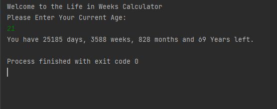

# Some More Basics of Python.

## In this project there are 4 Programs.

### 1. BMI Calculator:- This Program Calculates the Body Mass Index from the provided details. 

### 2. Life in Weeks:- This Program Calculates How many Days, Weeks, Months and Years you have until you turn 90.

### 3. Tip Calculator:- This Program Tells how much money each friend should pay after they have eaten in a restaurant.

### 4. Digits Sum Calculator:- This Programs Calculates the Sum of Digits of a number.

## Doing This Project Helped me Understand.
1. Variables.
2. For Loop.
3. Better Use of F-Strings.
4. Better Formatting of Output.
5. Better Understanding of the Syntax